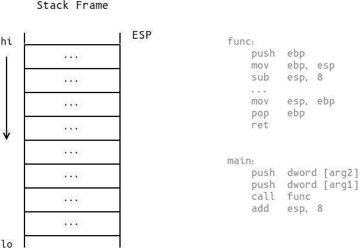

# *Calling Convention*

*Calling convention* adalah aturan bagaimana memanggil (*call*) dan kembali (*return*) dari subrutin.
Aturan ini diperlukan oleh programmer agar kode dan pustaka yang dibuat dapat saling bekerja sama.
Salah satu contoh yang akan kita gunakan adalah *C calling convention* (`cdecl`).
Dengan mengikuti konvensi ini, subrutin *assembly* yang dibuat bisa dipanggil dari kode C dan C++.

*Calling convention* dibagi menjadi dua aturan, bagi:

1. pemanggil subrutin (*caller*)
2. subrutin yang dipanggil (*callee*)

Jika aturan tersebut tidak diikuti, akan berakibat pada kesalahan fatal, karena *stack*
akan berada pada kondisi yang tidak konsisten.

Berikut gambaran dari isi *stack* selama eksekusi subrutin dengan tiga parameter
dan dua variabel lokal. Tiap sel lebarnya 4 *bytes*. Parameter pertama terletak
pada 8 *bytes* setelah `EBP`. Di atas parameter pada *stack* adalah *return address*
yang diletakkan oleh instruksi `CALL`. Saat instruksi `RET` dijalankan untuk
kembali dari subrutin, maka akan loncat ke alamat yang disimpan di *stack* ini.


```
 hi |      ...      |
    +---------------+                   #
    |  Parameter 3  |  EBP + 16         |
    +---------------+                   |
    |  Parameter 2  |  EBP + 12         |
    +---------------+                   | Caller
    |  Parameter 1  |  EBP + 8          |
    +---------------+                   |
    |  Return addr  |                   |
    +---------------+                   #
    |  Caller EBP   |  EBP              |
    +---------------+                   |
    |  Local var 1  |  EBP - 4          | Callee
    +---------------+                   |
    |  Local var 2  |  ESP              |
    +---------------+                   #
low |     ...       |

       Stack Frame
```


## Aturan *Caller*

1. Register `EAX`, `ECX`, dan `EDX` akan dipakai oleh subrutin (*caller-saved*: simpan ke *stack* jika masih dipakai).
2. Parameter dikirim dengan `PUSH` ke *stack* sebelum melakukan `CALL` dengan urutan terbalik.
3. Setelah kembali dari subrutin, mengembalikan *stack* ke keadaan seperti semula.

## Aturan *Callee*

1. Simpan nilai `EBP` ke *stack* dan salin nilai `ESP` ke `EBP`.
2. Alokasikan variabel lokal di *stack*.
3. Simpan nilai `EBX`, `EDI`, dan `ESI` ke *stack* jika ingin dipakai (*callee-saved*).
4. Nilai kembalian disimpan di `EAX`.
5. Kembalikan nilai `EBX`, `EDI`, dan `ESI` dari *stack* jika sebelumnya dipakai.
6. Dealokasi variabel lokal.
7. Kembalikan nilai `EBP` dari *stack*.

## Contoh

[`call.asm`](ex/call.asm)

```c
int sum_double(int a, int b) {
    int c = 2;
    return (a + b) * c;
}
```


```nasm
    main:
                ; sum_double(10, 5) --> eax = 30
                push    dword 5
                push    dword 10
                call    sum_double
                add     esp, 8

    sum_double:
                push    ebp                     ; save old ebp
                mov     ebp, esp                ; set this ebp

                sub     esp, 4                  ; allocate 1 local vars
                mov     dword [ebp-4], 2        ; c = 2

                mov     eax, [ebp+8]            ; eax = a   --> a
                add     eax, [ebp+12]           ; eax += b  --> a + b
                mul     dword [ebp-4]           ; eax *= c  --> (a + b) * c

                mov     esp, ebp                ; deallocate local vars
                pop     ebp                     ; restore old ebp
                ret
```


